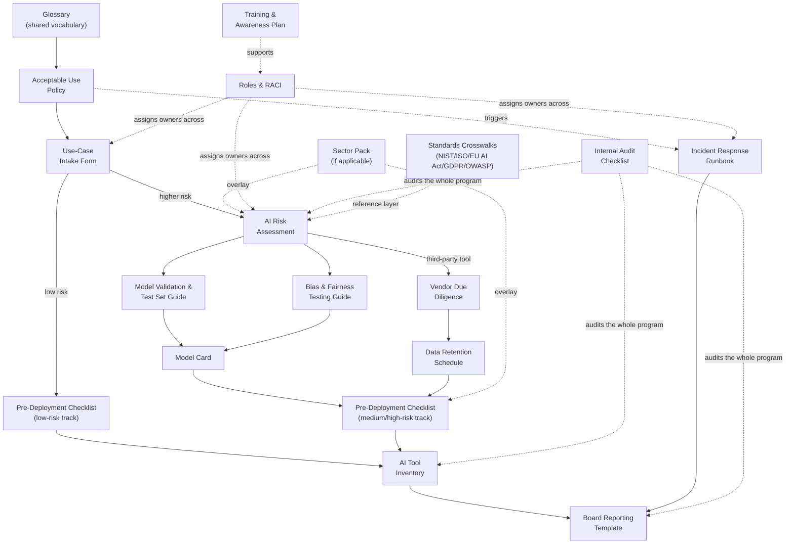

# GovernTrace AI Framework

 [](LICENSE)

A practical, ready-to-use AI governance framework for organizations that need to manage AI risk but don't have a dedicated compliance team. Fill in a few templates, adopt one policy, and you have a working governance program — crosswalked against [NIST AI RMF](docs/standards/nist-ai-rmf-crosswalk.md), [ISO/IEC 42001](docs/standards/iso-42001-crosswalk.md), the [EU AI Act's risk tiers](docs/standards/eu-ai-act-risk-tiers.md), [GDPR](docs/standards/gdpr-mapping.md), and [OWASP AI security guidance](docs/standards/owasp-ai-mapping.md) so it holds up to outside scrutiny.

This is **not** a compliance product or legal advice — it's a starting point you adapt to your organization, industry, and jurisdiction.

> **Note:** the intake and risk-assessment templates here are intentionally lightweight (plain markdown, filled in by hand). For teams that outgrow that and want intake/assessment tracked as live, structured data with workflow automation, that's the direction of the companion [GovernTrace AI Platform]((https://github.com/jaykerzb/GovernTrace-AI)) (in development) — this repo will remain the standalone, no-infrastructure-required version.

## Who this is for

Small and mid-sized organizations that are:
- Already using AI tools (ChatGPT, Copilot, custom LLM features) without a formal process around them
- Building AI-powered features and need lightweight gates before shipping
- Bringing in third-party AI vendors and need a due-diligence process
- Getting asked "how do you govern AI?" by a customer, board member, or regulator, and don't have a good answer yet

You don't need a compliance team to use this — the [Roles & RACI](docs/roles-and-raci.md) doc shows how to assign these responsibilities to roles you probably already have.

## What's covered

| Area | What it does |
|---|---|
| **Shared vocabulary** | A [glossary](docs/glossary.md) defining AI system types and core terms so your governance group applies the framework consistently |
| **Policy** | An acceptable-use policy governing how employees use AI tools day to day |
| **Risk management** | A structured way to classify and assess risk for any AI use case before it ships |
| **Development lifecycle gates** | Checklists that plug into your existing release process |
| **Vendor oversight** | Due-diligence questions specific to AI vendors (data use, model transparency, security) |
| **Model documentation** | Standardized model cards so every model in use has a documented intended use, evaluated performance, and known limitations |
| **Model validation** | A test set design and validation methodology so performance claims are backed by real, representative testing, not vibes |
| **Fairness testing** | A working methodology for testing AI outputs for bias/disparate impact across groups |
| **Data retention** | A schedule for how long AI-related data (prompts, outputs, logs) is kept and when it's deleted |
| **Incident response** | A runbook for triaging, containing, and closing out AI incidents |
| **Reporting** | A board/executive reporting template to keep leadership informed on AI risk posture |
| **Tool inventory** | A schema for tracking every AI tool in use, catching shadow AI, and feeding board reporting |
| **Training & awareness** | A tiered training plan so the policy and process actually get used, not just published |
| **Internal audit** | A checklist for auditing whether the governance program itself is functioning, not just whether documents exist |
| **Sector packs** | Regulatory overlays for [banking/financial services](sectors/banking-financial-services/README.md), [healthcare](sectors/healthcare/README.md), [insurance](sectors/insurance/README.md), [public sector](sectors/public-sector/README.md), [retail/e-commerce](sectors/retail-ecommerce/README.md), [education](sectors/education/README.md), [technology/SaaS](sectors/technology-saas/README.md), and [manufacturing/critical infrastructure](sectors/manufacturing-critical-infrastructure/README.md) |

## Quick start

0. **Agree on terms**: have your governance group read the [Glossary](docs/glossary.md) first — it defines AI system types and the vocabulary every other template assumes.
1. **Read and adapt** the [Acceptable Use Policy](policies/acceptable-use-policy.md) — fill in the brackets, run it through your normal policy approval process, publish it.
2. **Stand up intake**: point anyone requesting a new AI tool or building an AI feature at the [Use-Case Intake Form](templates/ai-use-case-intake-form.md), and start an [AI Tool Inventory](templates/ai-tool-inventory.md) to track everything that comes through it.
3. **Assess what needs it**: use cases flagged as higher-risk during intake get a full [AI Risk Assessment](templates/ai-risk-assessment.md); a new model gets [validated](templates/model-validation-testing-guide.md) and documented in a [Model Card](templates/model-card.md).
4. **Vet vendors**: any third-party AI tool goes through [Vendor Due Diligence](templates/vendor-due-diligence.md) before approval, with a [Data Retention Schedule](templates/data-retention-schedule.md) set for it.
5. **Gate deployment**: every AI feature or tool goes through the [Pre-Deployment Checklist](checklists/pre-deployment-checklist.md) (low-risk or medium/high-risk track) before go-live — Medium/High risk systems affecting people also get a [Bias & Fairness Test](templates/bias-fairness-testing-guide.md).
6. **Assign ownership and train people**: use [Roles & RACI](docs/roles-and-raci.md) to name who's accountable for each step, then run the [Training & Awareness Plan](templates/training-and-awareness-plan.md) so the process is actually usable, not just documented.
7. **Be ready for incidents and reporting**: keep the [Incident Response Runbook](templates/incident-response-runbook.md) on hand, and brief leadership periodically with the [Board Reporting Template](templates/board-reporting-template.md).
8. **Apply your sector pack**: if you're in a covered industry, layer the matching [sector pack](sectors/README.md) on top for regulatory-specific risk categories and checklist items.
9. **Check your own work**: run the [Internal Audit Checklist](docs/internal-audit-checklist.md) annually to confirm the program is actually functioning as designed, not just that the documents exist.

That's a working Level 2 governance program (see the [Maturity Model](docs/maturity-model.md)). Everything else in `docs/` and `sectors/` is there for when you want to go deeper.

Not sure what any of this looks like filled in? See the [worked example](examples/loan-prequalification-chatbot/README.md) — a fictional bank's loan pre-qualification chatbot walked through every template above, end to end.

## Repository structure

```
├── policies/
│   └── acceptable-use-policy.md      # Org-wide AI usage policy
├── templates/
│   ├── ai-use-case-intake-form.md    # Front door for any new AI tool/use case
│   ├── ai-risk-assessment.md         # Full risk assessment (NIST-aligned)
│   ├── vendor-due-diligence.md       # Third-party AI vendor vetting
│   ├── model-card.md                 # Standardized per-model documentation
│   ├── model-validation-testing-guide.md # Test set design and validation methodology
│   ├── bias-fairness-testing-guide.md # Methodology for testing outputs for disparate impact
│   ├── data-retention-schedule.md    # How long AI-related data is kept, per system
│   ├── incident-response-runbook.md  # Triage → contain → notify → remediate → close
│   ├── board-reporting-template.md   # Periodic leadership/board briefing
│   ├── ai-tool-inventory.md          # Schema for tracking every AI tool in use, catching shadow AI
│   └── training-and-awareness-plan.md # Tiered training so the process actually gets used
├── checklists/
│   └── pre-deployment-checklist.md   # Go-live gate, low-risk and high-risk tracks
└── docs/
    ├── glossary.md                   # AI system types and shared definitions
    ├── roles-and-raci.md             # Who owns what
    ├── maturity-model.md             # Self-assessment: where are you, what's next
    ├── internal-audit-checklist.md   # Audits whether the program itself is functioning
    └── standards/
        ├── nist-ai-rmf-crosswalk.md      # Subcategory-level mapping to NIST AI RMF
        ├── iso-42001-crosswalk.md        # Clause/Annex A mapping to ISO/IEC 42001
        ├── eu-ai-act-risk-tiers.md       # Risk-tier triage against the EU AI Act
        ├── gdpr-mapping.md                # Data protection concepts most relevant to AI
        └── owasp-ai-mapping.md           # LLM/ML Top 10 security checklist mapping
sectors/                                  # Regulatory overlays layered on the core templates
├── banking-financial-services/README.md  # SR 11-7, ECOA/Reg B, fair lending, BSA/AML
├── healthcare/README.md                  # HIPAA, FDA SaMD, clinical/coverage AI
├── insurance/README.md                   # NAIC AI Model Bulletin, state rating/claims rules
├── public-sector/README.md               # Due process, procurement, algorithmic accountability laws
├── retail-ecommerce/README.md            # FTC dark patterns, algorithmic pricing, AI-washing
├── education/README.md                   # FERPA, COPPA, academic-decision explainability
├── technology-saas/README.md             # Provider/deployer status, downstream regulatory pass-through
└── manufacturing-critical-infrastructure/README.md  # Physical safety, OT/IT boundary, fail-safe design

examples/                                 # Fully filled-out worked examples
└── loan-prequalification-chatbot/        # Banking scenario, every template completed end to end
```

## Framework map

How the pieces connect, end to end:



Solid arrows are the sequence a single use case moves through. Dashed arrows are cross-cutting — they apply across many use cases at once rather than sitting in the linear flow.

## How deep to go

- **Just need something today?** Adopt the policy, use the intake form and pre-deployment checklist. That alone puts a stop to ungoverned AI sprawl.
- **Shipping AI features regularly?** Add the risk assessment and vendor due-diligence templates into your existing PR/release process.
- **Need to show this to auditors, customers, or a board?** Use the [NIST AI RMF crosswalk](docs/standards/nist-ai-rmf-crosswalk.md) and [maturity model](docs/maturity-model.md) to frame what you've built in terms they recognize. If you're EU-exposed, also check [EU AI Act risk tiers](docs/standards/eu-ai-act-risk-tiers.md); if you process personal data broadly, check the [GDPR mapping](docs/standards/gdpr-mapping.md); if certification is on the table, see the [ISO/IEC 42001 crosswalk](docs/standards/iso-42001-crosswalk.md) and run the [Internal Audit Checklist](docs/internal-audit-checklist.md) first.
- **In a regulated industry?** Check the [sector packs](sectors/README.md) — eight industries each get sector-specific risk categories and regulatory context layered on top of the core templates.
- **Worried the program looks good on paper but isn't really working?** Run the [Internal Audit Checklist](docs/internal-audit-checklist.md) — it checks coverage (is everything actually going through the process), quality (are completed documents rubber-stamped or real), and whether the controls you documented actually function.

## Scope and limitations

- Templates are deliberately framework-agnostic markdown — no tooling lock-in, easy to drop into a wiki, Notion, or a `governance/` folder in your existing repo.
- This does not implement or certify compliance with any specific regulation (EU AI Act, NIST AI RMF, ISO/IEC 42001) — the [standards crosswalks](docs/standards/) show *directional* alignment and honest gaps, not certification. Involve legal/compliance for anything regulator-facing.
- Security guidance here is a checklist, not a penetration test — high-risk systems still need real security review.

## Contributing

Issues and PRs welcome — see [CONTRIBUTING.md](CONTRIBUTING.md) for what's useful to contribute and how to propose something bigger than a typo fix, and [CODE_OF_CONDUCT.md](CODE_OF_CONDUCT.md) for how we expect people to treat each other here. See [CHANGELOG.md](CHANGELOG.md) for version history and [SECURITY.md](SECURITY.md) to report a security concern.

## License

[MIT](LICENSE)
